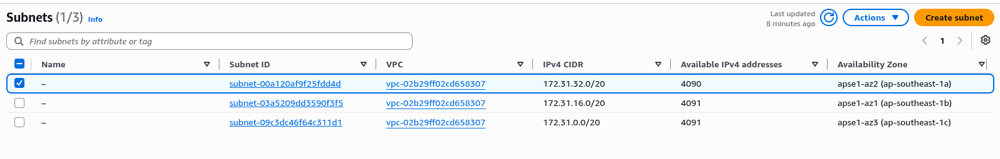
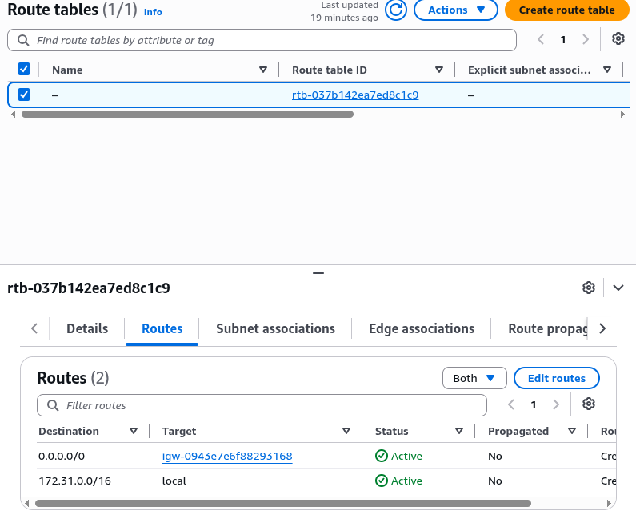
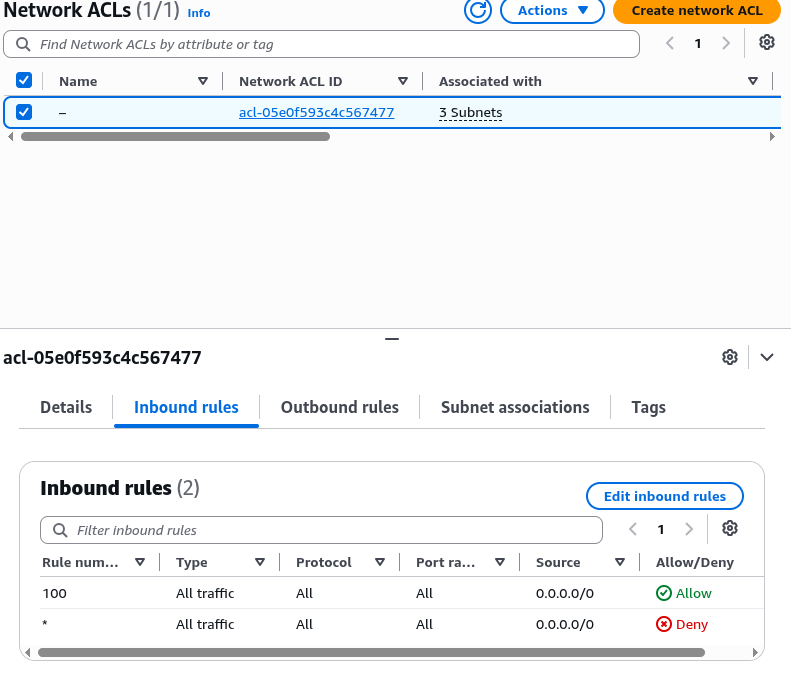
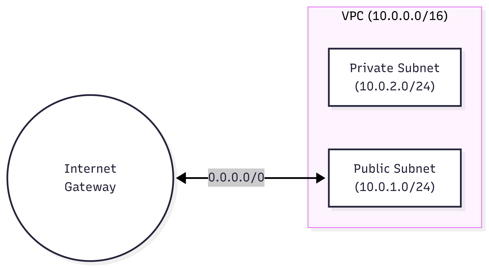

# Assignment 2 Submission

<!--
How to use this template:

1. Copy this file to submissions/assignment-2/<your-github-username>/submission.md
2. Replace every answer placeholder with your own answer. Delete the angle brackets too.
3. Save your four images in the same folder, with the exact file names below.
4. Do not write your full name or your student number in this file.
-->

## About me

- GitHub username: TroyMichaelCamarillo
- Section: DCSAD
- IAM user name that I signed in with: dcsad-g07
- X: 139

---

## Part A. Explore

### A1. The VPC

Default VPC IPv4 CIDR:

172.31.0.0/16

Number of addresses in that CIDR:

65,536

### A2. The subnets

| Availability Zone | IPv4 CIDR |
| --- | --- |
| ap-southeast-1a | 172.31.32.0/20 |
| ap-southeast-1b | 172.31.16.0/20 |
| ap-southeast-1c | 172.31.0.0/20 |

Screenshot 1. Save it as `screenshot-1-subnets.png` in your folder. The image line below shows it.

### A3. Available addresses

Available IPv4 addresses in each subnet:

ap-southeast-1a has 4090, ap-southeast-1b has 4091, and ap-southeast-1c has 4091.

Why is the number lower than 4,096?

AWS reserves 5 addresses in every subnet.

What uses the missing address in the subnet with the lowest number?

ap-southeast-1a has one less address, according to the README, a network interface holds one address which is used by a resource like an instance.

### A4. The route table

| Destination | Target |
| --- | --- |
| 0.0.0.0/0 | igw |
| 172.31.0.0/16 | local |

Screenshot 2. Save it as `screenshot-2-routes.png` in your folder. The image line below shows it.

### A5. Public or private

Are the default subnets public or private? Which route proves it?

Public, since the route 0.0.0.0/0 sends traffic to the internet gateway.

### A6. The internet gateway

State of the internet gateway:

Attached

What happens to the default subnets if the gateway is detached?

Route 0.0.0.0/0 has no working targets so the subnets lose its path to the internet but instances can still reach each other through local route.

### A7. NAT gateways

Number of NAT gateways:

0

Can a server in a new private subnet download updates? Why?

No because a private subnet uses a route table with the local route only. Without a NAT gateway and a 0.0.0.0/0 route pointing to it, the server has no path to the internet to get updates.

### A8. The network ACL

| Rule number | Source | Allow or Deny |
| --- | --- | --- |
| 100 | 0.0.0.0/0 | Allow |
| * | 0.0.0.0/0 | Deny |

How is a network ACL different from a security group?

A network ACL protects a whole subnet and is stateless. It's replies need their own outbound rule. A security group protects a signle resource, is stateful, and has allow only rules whereas a network ACL can also have deny rules.

Screenshot 3. Save it as `screenshot-3-network-acl.png` in your folder. The image line below shows it.

### A9. The default security group

Inbound rule (type and source):

All traffic, sg-0c5b6d4081cf0a534 / default

Which resources can send traffic to an instance that uses it?

Other resources that are assigned to the same security group.

---

## Part B. Prepare

### B1. Plan two subnets

- Public subnet CIDR: 10.0.1.0/24
- Private subnet CIDR: 10.0.2.0/24

### B2. Route tables

Route table of the public subnet:

| Destination | Target |
| --- | --- |
| 10.0.0.0/16 | local |
| 0.0.0.0/0 | igw |

Route table of the private subnet:

| Destination | Target |
| --- | --- |
| 10.0.0.16 | local |

### B3. My VPC diagram

Tool used (Excalidraw, draw.io, Lucidchart, or paper):

Mermaid.Js

Save your diagram as `vpc-diagram.png` in your folder. The image line below shows it.

### B4. Predict a change

Can you still open the web page from your laptop? Why?

No, without the 0.0.0.0/0 route pointing to the Internet Gateway, traffic from the internet has no way to reach the instance, and the instance has no path to send replies back to my laptop.

Can the instance still reach another instance in the VPC? Why?

Yes, the route table still has the local route active, which handles all internal traffic between any subnets in the same VPC.

### B5. Place a database

Which subnet gets the database? Why?

The private subnet. Databases contain sensitive back-end data and should never be directly accessible from the public internet. Placing it in the private subnet ensures it can only be accessed internally by your own web servers in the public subnet.

### B6. My question about VPCs

What is your question, and what made you think of it?

If security groups are stateful and network ACLs are stateless, if they conflict with each other, which one takes priority and blocks the traffic e.g security group allows traffic but ACL denies it.
